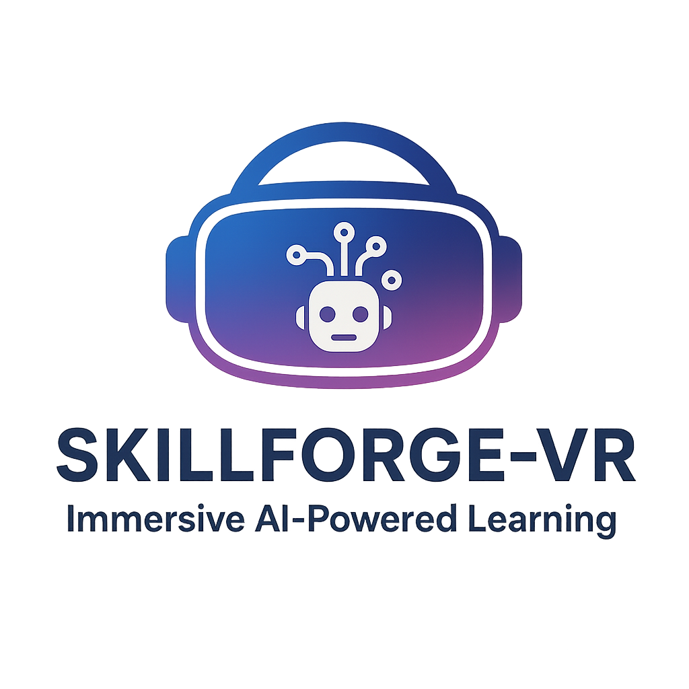
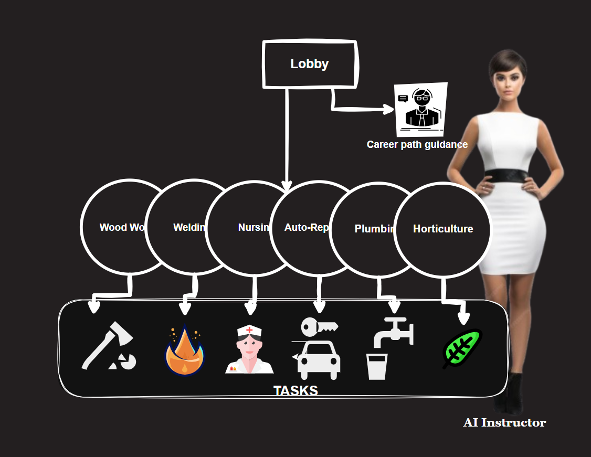

  

# SkillForge-VR

An immersive, AI-powered PCVR application for Technical and Vocational Education and Training (TVET), built for the IEEE Metaverse Competition. SkillForge-VR uses a voice-first interface so beginners can learn hands-on trades in natural language without wrestling with complex VR menus.

---

## 🚩 Problem
- Traditional VR training relies on complex UIs that overwhelm beginners.
- Traditional vocational training in Nigeria is often static, language-limited, and difficult to scale.
- Learners struggle to connect theory to hands-on practice.
- The formal system rarely accommodates diverse learning paces and individual learning patterns.
- Language barriers hinder access because training is not delivered in local languages (Hausa, Igbo, Yoruba), unlike real workshops.

---

## 💡 Solution

SkillForge-VR combines adaptive AI with a voice-first VR interface:

- Primary input: Voice (VUI) — players interact mainly by speaking; controllers are optional/fallback.
- PCVR support — optimized for PC-based VR headsets for high-fidelity simulation.
- Adaptive AI Tutors — adjust difficulty, pace, and learning paths in real time.
- Career Guidance Lobby — an AI mentor aligns interests to specific TVET sub-fields.
- Workshop Simulations — AI Instructors guide step-by-step practice (e.g., carpentry, welding, tailoring, mechanics).
- Multilingual — Hausa, Igbo, Yoruba (plus English).
- Gamification — tasks, levels, rewards, and progress tracking to sustain engagement.
- For all ages — suitable for children and adults.

---

## 🗣️ Voice-First Interaction (AI-Powered VUI)

Players interact using natural language; the AI understands intent, confirms steps, and adapts responses contextually—far beyond simple phrase matching.

- Activation:
  - Push-to-talk: Hold the controller trigger (or mapped key) while speaking.
- AI Confirmation:
  - The system confirms recognized commands and next steps, clarifies ambiguous requests, and guides users interactively.
- Feedback:
  - Spoken responses via TTS with on-screen captions/subtitles.
  - Visual highlights on referenced objects and steps.
- Disambiguation:
  - If multiple objects match a command, the AI numbers/highlights candidates and prompts for selection 
- Fallback:
  - Simple controller/gaze click for confirm/cancel, tool pick-up, and locomotion in noisy environments.

### Example voice intents

- Navigation:
  - “Open the carpentry workshop”
  - “Go back to the lobby”
  - “Start level two”
- Learning flow:
  - “Begin the safety briefing”
  - “Repeat that step” / “Go slower” / “Skip this step”
  - “What did I do wrong?” / “Show me the correct technique”
- Workshop actions:
  - “Select the measuring tape” / “Clamp the wood”
  - “Calibrate the welder” / “Lower the voltage to 18”
  - “Start the sewing machine”
- Meta and control:
  - “Pause training” / “Resume”
  - “Save my progress” / “Show my progress”
  - “Open the checklist” / “Show hints”
- Language:
  - “Switch to Yoruba” / “Speak in Igbo” / “Use Hausa”
- Accessibility:
  - “Enable captions” / “Increase text size”

### VUI pipeline (high level)

- ASR (speech-to-text) captures the user’s voice.
- NLU maps utterances to intents and parameters given scene context.
- Orchestrator triggers VR actions and AI Instructor responses.
- TTS (text-to-speech) delivers multilingual audio with captions.

Latency targets: <500 ms for command-and-control; longer for complex tutoring responses.

---

## 🛠 Workflow

1. VR Lobby
   - AI Career Guide: Discuss interests; get tailored TVET recommendations.
   - Workshops: Pick a trade and start guided practice.
     
  Demo: [SkillForge-VR in action](https://www.youtube.com/watch?v=ltrWb-F3pUQ&t=10s)

  <iframe width="560" height="315" 
    src="https://www.youtube.com/embed/ltrWb-F3pUQ?start=10" 
    title="SkillForge-VR Demo" 
    style="border:0;" 
    allow="accelerometer; autoplay; clipboard-write; encrypted-media; gyroscope; picture-in-picture" 
    allowfullscreen>
  </iframe>

2. AI Career Guide
   - Conversational intake about passions, skills, and constraints.
   - Mentor explains trade-offs, market demand, and learning paths.

3. Workshop Learning
   - AI Instructor assigns tasks and provides step-by-step guidance.
   - Real-time adaptation based on performance and voice feedback.

4. Feedback & Progress
   - Adaptive progression, challenges, badges, and certifications.

---

## 📊 Workflow Diagram

---

## 📷 User Testing (Early)

- Beginners completed tasks faster with voice than with traditional VR menus.
- Children and adults adapted quickly to task-driven, conversational guidance.
- Dynamic difficulty and timely feedback increased engagement.

---

## 🌍 Impact

- Bridges formal TVET and real-world workshops.
- Makes training accessible in local languages with adaptive pacing.
- Scalable model for global, hands-on skills training in VR.

---

## 🔧 Requirements & Notes

- Platform: PCVR (tested with PC-powered headsets).
- Audio: Headset mic recommended for accurate ASR; captions available.
- Noisy environments: Prefer push-to-talk and/or controller fallback.

---

## 🔗 About the Project

Built with Unreal Engine and integrated AI for adaptive tutoring and natural interactions. Voice is the primary interaction method; controllers are supported for accessibility and fallback.